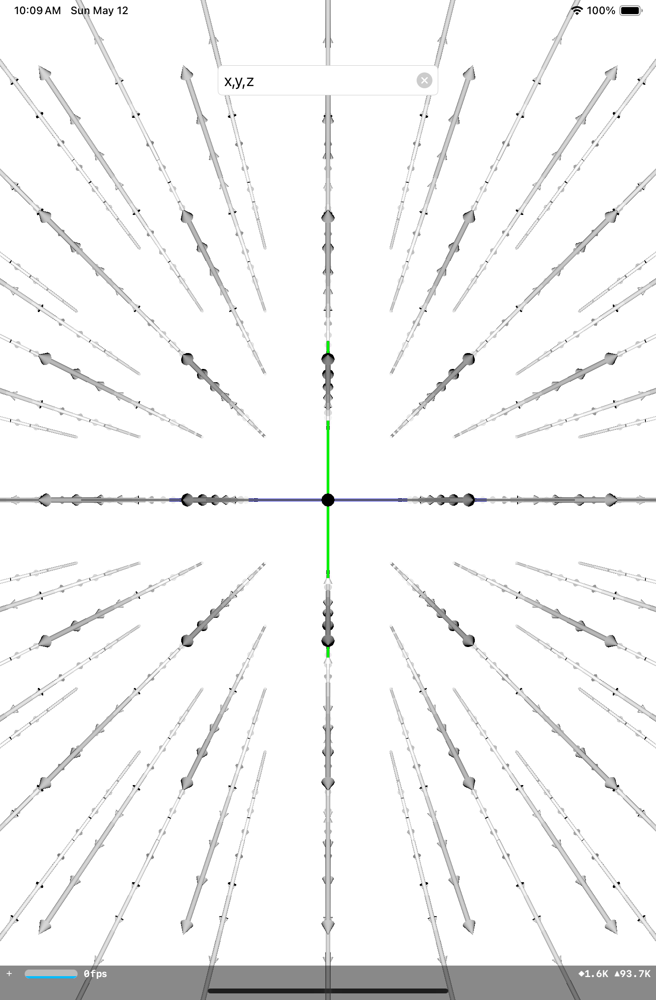
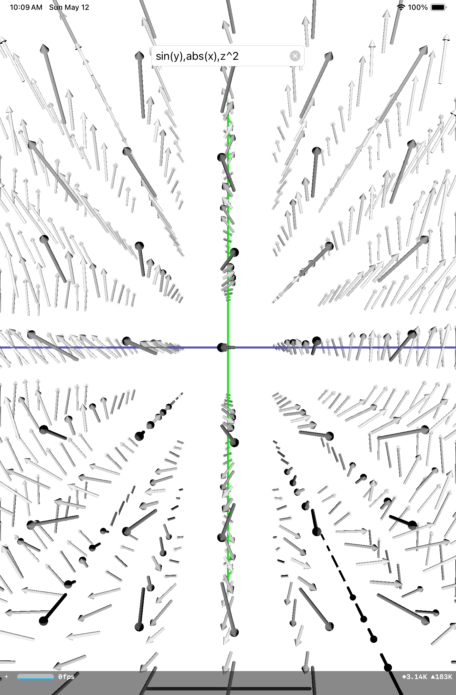

# Vector Fields

## About
Simply enter a vector field to view it in Augmented Reality. I created this app for the final project of my Multivariable Calculus class since I had been working with AR for a project completely unrelated to school where some of the basic parts like the arrows themselves could be reused, and I figured something like this could be fun, especially since the project guidelines allowed us to do pretty much anything as long as some calculus was involved.

## Acknowledgments
This is heavily based on this cool [Desmos 3D graph](https://www.desmos.com/3d/lwagvtqhn3) by Elliot Wymore that allows you to input each component of a vector field and see it graphed. That was largely my reference for this project. One thing to note though is that in Desmos, the z-axis is up, but in SceneKit, it is the y-axis, which does not really change many things. 

## Usage
When the app is launched, there will be a popup asking you to input a vector field. Enter one in the text box in the top center of the app. As long as it is valid, it will be graphed. You should receive a warning popup if that is not the case. Please enter the vector field as one string, with each of the three components separated by commas, and no parentheses, then hit `Done`. Each component can be a function of `x`, `y`, `z`, or even constant. You can input almost anything, including square roots, absolute values, powers, and logarithms, but you might need to type them in as pseudo-Swift so it can be parsed properly. This does mean that to multiply two or more terms, you need to type in a `*` between each one, etc. Also, the length of each arrow corresponds to the magnitude of the vector at that point, and lastly, people occlusion is enabled.

## Challenges
* Orienting the vector correctly: solved using the `look(at:up:localFront:)`, where `up` and `localFront` are both the *j* vector, instead of using the `atan2` function, which was my inital method.
* Passing in custom values to the vector field: solved using `NSExpression` to evaluate each component, where the variables are replaced with their actual values using `replacingOccurrences(of:with:)`.

## Installation
1. Clone this repository or download it as a zip folder and uncompress it.
2. Open up the `.xcodeproj` file, which should automatically launch Xcode.
3. You might need to change the signing of the app from the current one.
4. Click the `Run` button near the top left of Xcode to build and install.

#### Prerequisites
Hopefully this goes without saying, but you need Xcode, which is only available on Macs.

#### Notes
You can run this app on the Xcode simulator or connect a physical device.  
The device must be either an iPhone or iPad running iOS 16.0 or newer.  
If using a simulator, you can only view the vector field along the x-axis.

## SDKs
* [ARKit](https://developer.apple.com/documentation/arkit/) - Integrate hardware sensing features to produce augmented reality apps and games.
* [SceneKit](https://developer.apple.com/documentation/scenekit/) - Create 3D games and add 3D content to apps using high-level scene descriptions.
* [UIKit](https://developer.apple.com/documentation/uikit/) - Construct and manage a graphical, event-driven user interface for your iOS, iPadOS, or tvOS app.
* [Swift](https://developer.apple.com/swift/) - A powerful and intuitive programming language for all Apple platforms.

## Bugs
I have not tested this app super rigorously, so I would not be surprised if there were more than the known ones. If you find any, feel free to open up a new issue or even better, create a pull request fixing it.

#### Known
- [ ] Vector fields that seem like they should work may crash the app. Workaround: just restart the app and enter the vector field again, but make sure the syntax looks correct and add parenthesis as needed.

#### Resolved
- [x] Trigonometric functions are not supported because they are forbidden from `NSExpression`. Partially fixed by replacing only `sin` and `cos` with the first 10 terms of their [Taylor Series](https://en.wikipedia.org/wiki/Taylor_series#Trigonometric_functions), as suggested by my amazing math teacher. This is sometimes a little bit finicky.

## Change Log
* v1.0 - initial release
* v1.1 - some sin/cos support
* v1.2 - better error handling
* v1.3 - improved regex matching

## To-Do List
- [ ] Add ability to change world origin
- [ ] Add sliders to control arrow attributes

## Contributors
Sachin Agrawal: I'm a self-taught programmer who knows many languages and I'm into app, game, and web development. For more information, check out my website or Github profile. If you would like to contact me, my email is [github@sachin.email](mailto:github@sachin.email).

## License
This package is licensed under the [MIT License](LICENSE.txt).
