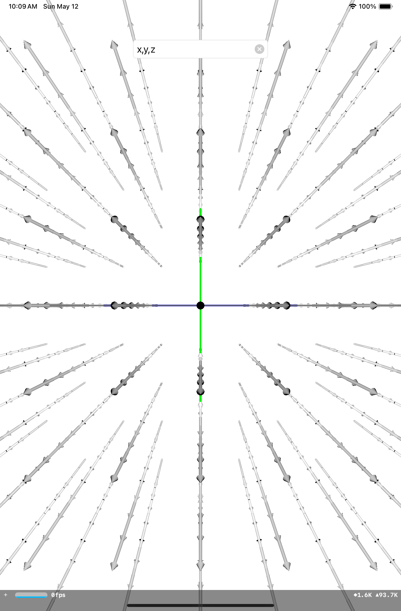
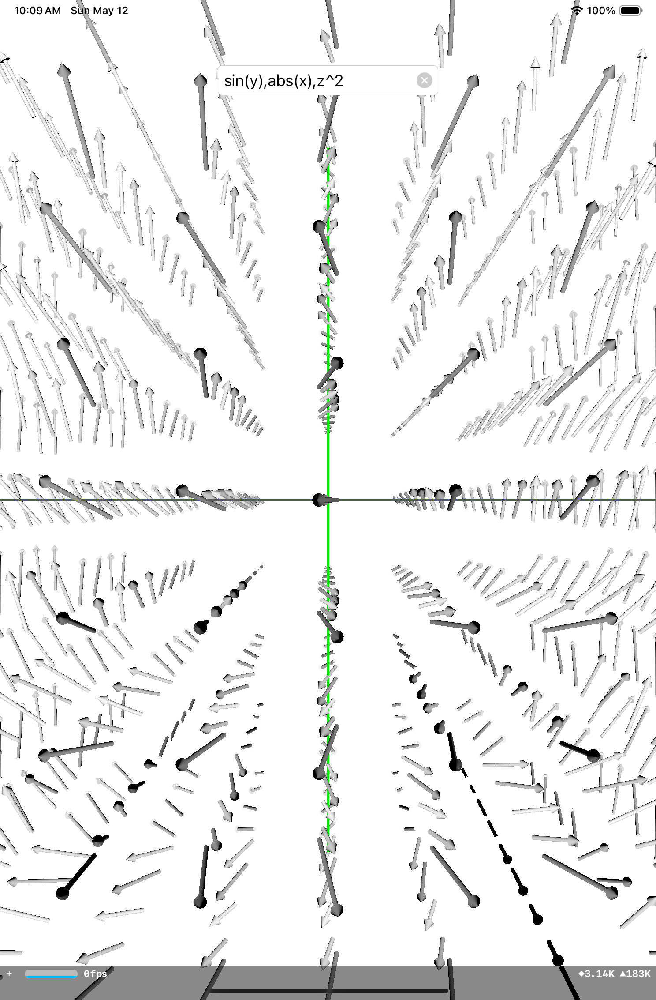

# Vector Fields

## About
Simply enter a vector field to view it in Augmented Reality. I created this app for the final project of my Multivariable Calculus class since I had been working with AR for a project completely unrelated to school where some of the basic parts like the arrows themselves could be reused, and I figured something like this could be fun, especially since the project guidelines allowed us to do pretty much anything as long as some calculus was involved.

## Acknowledgments
This is heavily based on this cool [Desmos 3D graph](https://www.desmos.com/3d/lwagvtqhn3) by Elliot Wymore that allows you to input each component of a vector field and see it graphed. That was largely my reference for this project. One thing to note though is that in Desmos, the z-axis is up, but in SceneKit, it is the y-axis, which does not really change many things. 

## Usage
When the app is launched, there will be a popup asking you to input a vector field. Enter one in the text box in the top center of the app. As long as it is valid, it will be graphed. You should receive a warning popup if that is not the case. Please enter the vector field as one string, with each of the three components separated by commas, then hit `Done`. Each component can be a function of `x`, `y`, `z`, or even constant.  
The length of each arrow corresponds to the magnitude of the vector at that point, and the relative lengths of all arrows can be adjusted using the associated slider. The thickness of the arrows can also be adjusted the slider below the aforementioned one.  
Other things to note are that people occlusion is enabled, and the world origin (and therefore the grid origin) has the ability to be moved to the location of an ArUco marker. Currently, only the `6x6_1000-0` marker can be used, but look at `AddMarkers.md` to see how to add more. As soon as the marker is detected, the grid and any vectors present will move.

## Syntax
Expressions are parsed by `ExpressionEvaluator.swift`, so what you type is ordinary math rather than pseudo-Swift.

* **Variables**: `x`, `y`, `z`, in any capitalization. Writing them next to each other multiplies them, so `xy` means `x*y`.
* **Constants**: `pi` (or `π`), `tau` (or `τ`), `e`, `phi` (or `φ`).
* **Operators**: `+`, `-`, `*`, `/`, `%`, and `^` for powers. `^` is right associative, so `2^3^2` is `512`.
* **Implicit multiplication**: `2x`, `3sin(y)`, and `(x+1)(x-1)` all work, so the `*` is optional.
* **Negative bases**: `(-8)^(1/3)` gives `-2` rather than `NaN`, and the same goes for any odd root.
* **Numbers**: decimals and scientific notation, such as `1.5e-2`.
* **Parentheses**: nest as deeply as you like. Angles are in radians; use `radians(90)` if you would rather type degrees.

#### Supported Functions
| Category | Functions |
| --- | --- |
| Trigonometric | `sin` `cos` `tan` `csc` `sec` `cot` (also spelled out, e.g. `sine`, `cosecant`) |
| Inverse trigonometric | `asin` `acos` `atan` `acsc` `asec` `acot` `atan2(y, x)` (also `arcsin`, `arccos`, …) |
| Hyperbolic | `sinh` `cosh` `tanh` `csch` `sech` `coth` `asinh` `acosh` `atanh` |
| Exponential & logarithmic | `exp` `ln` `log` (base 10) `log(b, v)` (base *b*) `log2` `log10` |
| Powers & roots | `sqrt` `cbrt` `pow(a, b)` `root(n, v)` `hypot(a, b, …)` |
| Rounding & sign | `abs` `sign` (or `sgn`) `floor` `ceil` `round` `trunc` |
| Comparison & other | `min(…)` `max(…)` `clamp(v, lo, hi)` `mod(a, b)` `radians` `degrees` |

Anything not on that list is not supported and produces an explanatory popup instead of a crash. The same goes for a stray operator, a mismatched `)`, or the wrong number of arguments.

#### Automatic Corrections
Parentheses are tracked with a stack, which makes a few common mistakes recoverable. In each case the field is graphed and a popup says what was changed.

* A missing `)` is added, in the place that makes sense: `sin(x, cos(y), z` becomes `sin(x), cos(y), z`, while `x, y, sin(z` becomes `x, y, sin(z)`.
* Parentheses wrapping the whole field are removed, so `(-y, x, 0)` is now accepted instead of rejected.
* Commas inside a function call no longer count as component separators, so `atan2(y, x), 0, 0` is read as three components rather than four.

A `)` with no matching `(` is still an error, since there is no way to know where the missing `(` belonged.

## Challenges
* Orienting the vector correctly: solved using the `look(at:up:localFront:)`, where `up` and `localFront` are both the *j* vector, instead of using the `atan2` function, which was my inital method.
* Passing in custom values to the vector field: originally solved using `NSExpression` to evaluate each component, where the variables are replaced with their actual values using `replacingOccurrences(of:with:)`.

## Installation
1. Clone this repository or download it as a zip folder and uncompress it.
2. Open up the `.xcodeproj` file, which should automatically launch Xcode.
3. You might need to change the signing of the app from the current one.
4. Click the `Run` button near the top left of Xcode to build and install.

#### Prerequisites
Hopefully this goes without saying, but you need Xcode, which is only available on Macs.

#### Notes
You can run this app on the Xcode simulator or connect a physical device.  
The device must be either an iPhone or iPad running iOS 26.0 or newer.  
If using a simulator, you can only view the vector field along the x-axis.

## SDKs
* [ARKit](https://developer.apple.com/documentation/arkit/) - Integrate hardware sensing features to produce augmented reality apps and games.
* [SceneKit](https://developer.apple.com/documentation/scenekit/) - Create 3D games and add 3D content to apps using high-level scene descriptions.
* [UIKit](https://developer.apple.com/documentation/uikit/) - Construct and manage a graphical, event-driven user interface for your iOS, iPadOS, or tvOS app.
* [Swift](https://developer.apple.com/swift/) - A powerful and intuitive programming language for all Apple platforms.

## Bugs
I have not tested this app super rigorously, so I would not be surprised if there were more than the known ones. If you find any, feel free to open up a new issue or even better, create a pull request fixing it.

#### Resolved
- [x] Vector fields that seem like they should work may crash the app. The cause was `NSExpression(format:)`, which raises an Objective-C `NSInvalidArgumentException` on anything it cannot parse, and Swift has no way to catch that, so the app died instead of showing a warning. Replaced with a parser that reports every failure as a Swift error.
- [x] Trigonometric functions are not supported because they are forbidden from `NSExpression`. Partially fixed by replacing only `sin` and `cos` with the first 10 terms of their [Taylor Series](https://en.wikipedia.org/wiki/Taylor_series#Trigonometric_functions), as suggested by my amazing math teacher. This is sometimes a little bit finicky. Fully fixed by the new parser, which calls the real `sin` and `cos` along with everything else in the table above.
- [x] The Taylor series gave wrong answers rather than approximate ones, because `^` in `NSExpression` is bitwise XOR and not exponentiation, so every `x^n` term was silently garbage. `sin(1)` came back as `-1` instead of `0.841`. Two of the factorial denominators were also mistyped. All moot now that the series are gone.
- [x] Arrows pointed in the wrong direction. The direction was measured from the sample point `(x, y, z)` while the arrow was drawn at `(x/2, y/2, z/2)`, so every non-constant field was skewed toward the origin.

## Change Log
* v1.0 - initial release
* v1.1 - some sin/cos support
* v1.2 - better error handling
* v1.3 - improved regex matching
* v1.4 - change world origin
* v1.5 - support iOS 18 icons
* v1.6 - add sliders & Liquid Glass
* v1.7 - new expression parser

## To-Do List
- [x] Add ability to change world origin
- [x] Add sliders to control arrow attributes

## Contributors
Sachin Agrawal: I'm a self-taught programmer who knows many languages and I'm into app, game, and web development. For more information, check out my website or Github profile. If you would like to contact me, my email is [github@sachin.email](mailto:github@sachin.email).

## License
This package is licensed under the [MIT License](LICENSE.txt).
